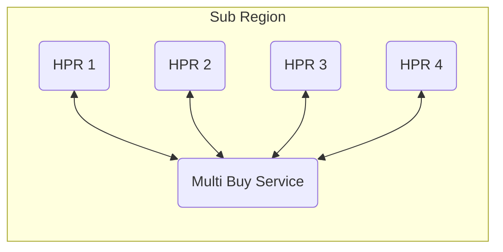

# Routing

This document describes the routing mechanism implemented post [HIP 70](https://github.com/helium/HIP/blob/main/0070-scaling-helium.md).

## Basics

1. Each hotspot connects to a global Geo DNS Load Balancer [^1] (LB). The LB then redirects each Hotspot to a cluster of Helium Packet Routers (HPR) in its own region. Ex: If a Hotspot is in San Francisco it will get round-robin[^2] to the North America Cluster, if another is in Paris France, it will get round-robin to the EU cluster. *Note that each region may have a different number of servers to accomodate for load.*
2. Each HPR gets its routing information from [Config Service](https://github.com/helium/oracles/tree/main/iot_config) (see [Routing Configuration](#routing-configuration)).
3. Data is then routed to appropriate LoRaWan Network Server (LNS)[^3].

## Configuration

All of the device routing information is contained in the [Config Service](https://github.com/helium/oracles/tree/main/iot_config) (CS). The CS can be interacted via [CLI](https://github.com/helium/helium-config-service-cli) or directly using the [Proto APIs](https://github.com/helium/proto/blob/master/src/service/iot_config.proto).

### OUI

At the top of it all is the [Org (or OUI)](https://github.com/helium/proto/blob/master/src/service/iot_config.proto#L46) which defines a few things, like the `owner` and `payer` keys [(see here)](https://github.com/helium/proto/blob/master/src/service/iot_config.proto#L46).

Upon request, an OUI is [created](https://github.com/helium/proto/blob/master/src/service/iot_config.proto#L650) and assigned by the fundation. You can, at this point, purchase [Device Addresses or DevAddrs](https://github.com/helium/proto/blob/master/src/service/iot_config.proto#L27). If you would like to roam on the Helium network and already have your own [LoRaWan Net ID](https://www.thethingsnetwork.org/docs/lorawan/prefix-assignments/) [see here](https://github.com/helium/proto/blob/master/src/service/iot_config.proto#L652).

### Route

Routes tells each HPR exactly where to send data packets. To [create](https://github.com/helium/proto/blob/master/src/service/iot_config.proto#L671) a [Route](https://github.com/helium/proto/blob/master/src/service/iot_config.proto#L120) we recommend using the [CLI](https://github.com/helium/helium-config-service-cli) for this step.

1. You will need to set your `net_id`, it should match the one assigned to you when you OUI was created.
2. Set its `oui`.
3. Set a `server` [see here](https://github.com/helium/proto/blob/master/src/service/iot_config.proto#L107).
    1. Set a `host` and `port`
    2. Pick a `protocol`
        1. `packet_router` is used to talk to (legacy) Helium Router/Console
        2. `gwmp` (GateWay Message Protocol) is used to talk to [Chirpstack](https://www.chirpstack.io/)
        3. `http_roaming` [see here](https://lora-alliance.org/wp-content/uploads/2022/01/TR010-1.0.0-LoRaWAN-Roaming-Hub.pdf).
4. Set `max_copies`, maximum number of copies bought by HPR. Ex: if an uplink is seen by multiple hotspots, how many copies of that packet will be purchased.
5. Set `active`, enable and disable route.

#### Joins / EUIs 

*[What are EUIS?](https://www.thethingsnetwork.org/docs/lorawan/addressing/)*

Device EUI and App EUI (aka EUIs) can be managed via the [update_euis service](https://github.com/helium/proto/blob/master/src/service/iot_config.proto#L686). These are usually handled by the LNS. *Helium's Router/Console already supports it and Chirpstack work is in progress.*

**Note: Any LNS or other entities that need to modify Routes or associated information need to be allowed to do so via the [delegate keys](https://github.com/helium/proto/blob/master/src/service/iot_config.proto#L53). Each service in the proto file should [list the permission](https://github.com/helium/proto/blob/master/src/service/iot_config.proto#L641). This allows for programatic update without need for OUI owner to do everything manually.**

#### Uplinks / DevAddr Ranges

A [DevAddr Range]([start_addr](https://github.com/helium/proto/blob/master/src/service/iot_config.proto#L59)) is a combination of `start_addr` and an `end_addr` that allows Routes to be confined to a specific range. Fox example, if my OUI is contained from `16#00000000` to `16#0000000A`, I could create 2 Routes:
1. Route 1: `16#00000000` to `16#00000005`
2. Route 2: `16#00000006` to `16#0000000A`
   
Notes:
- DevAddr ranges are inclusive on both sides.
- DevAddr ranges can overlap.
- If no range is set, by default, the Route will be set to the entire range of the OUI.

**It is  recommended to set a DevAddr Range and to avoid overlapping (even if allowed) as this will slow down data delivery to the LNSs.**

#### Session Key Filters

[What is a LoRaWan Network Session Key?](https://www.thethingsnetwork.org/docs/lorawan/security/)

A [Session Key Filter](https://github.com/helium/proto/blob/master/src/service/iot_config.proto#L412) (SKF) allows HPR to verify individual packets (**without being able to decode the data**). SKFs ensure that the packets are getting sent to the right LNS, as well as, charging the right account.

SKFs are usually kept up to date programatically by the LNS ([API](https://github.com/helium/proto/blob/master/src/service/iot_config.proto#L705)).

Note: Each SKF has a `max_copies` field which is the same concept as viewed previously in [Route](#route) but is device specific. SKF `max_copies` takes precendent over a Route's `max_copies`. However, setting a SKF `max_copies` to `0` will cause that device to use the Route's `max_copies` settings. If you are trying to not route packets for a device, the SKF for that device should be removed entirely.

## Multi Buy

`Multi buy` or `max_copies` is the maximum number of copies, seen by different hotspots, that can be bought by HPR. It can be set at 2 levels as seen previously, either [Route](https://github.com/helium/proto/blob/master/src/service/iot_config.proto#L129) or [SKF](https://github.com/helium/proto/blob/master/src/service/iot_config.proto#L417).

*A Multi Buy Service (MBS) is used as a distributed counter to make sure the proper number of copies is purchased. This service exists due to the fact that, hotspots that are in close proximity might be connected to different HPRs in the cluster.*

Note: If the MBS goes down, HPR will mark the packets as `free` to avoid charging users more than it should. This will also not reward hotspots.

[^1]: A Geo DNS load balancer is a tool that uses the location of the hotspot to direct their requests to the best server or data center. It combines DNS and load balancing to optimize traffic distribution based on geography, reducing latency and improving user experience.

[^2]: Round-robin algorithm evenly distributes requests among servers in a cyclic manner for balanced workload.

[^3]: A LoRaWAN Network Server is a central component in a LoRaWAN network that manages devices data, routing, security, and communication between LoRaWAN devices and application servers. It handles device registration, data validation, encryption, and ensures data reaches the correct destination for processing.
