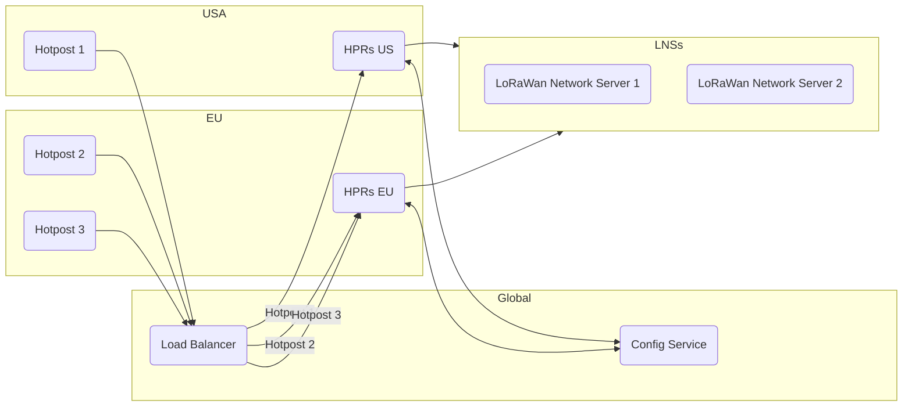

# Routing

This document describe the routing mechanism implemented post [HIP 70](https://github.com/helium/HIP/blob/main/0070-scaling-helium.md).

## Basics

1. Each hotspot now connects to a global Geo DNS Load Balancer [^1] (LB). The LB then redirect each Hotspot to a cluster of Helium Packet Router (HPR) in its own region. Ex: if a Hotspot is in San Francisco it will get round-robin[^2] to the North America Cluster, if another is in Paris France, it will get round-robin to the EU cluster. *Note that each region may have a different number of servers to accomodate for load.*
2. Each HPR gets its routing information from [Config Service](https://github.com/helium/oracles/tree/main/iot_config) (see [Routing Configuration](#routing-configuration)).
3. Data is then router to appropriate LoRaWan Network Server (LNS)[^3].

## Configuration

All of the devices' routing information is contained in the [Config Service](https://github.com/helium/oracles/tree/main/iot_config) (CS). The CS can be interacted via [CLI](https://github.com/helium/helium-config-service-cli) or directly using the [Proto APIs](https://github.com/helium/proto/blob/master/src/service/iot_config.proto).

### OUI 

Request to [create an organization or OUI](https://github.com/helium/proto/blob/master/src/service/iot_config.proto#L650) to the fundation. You can at this point purchase [Device Addresses or DevAddrs](https://github.com/helium/proto/blob/master/src/service/iot_config.proto#L27). If you would like to roam on the Helium network and already have your own [LoRaWan Net ID](https://www.thethingsnetwork.org/docs/lorawan/prefix-assignments/) [see here](https://github.com/helium/proto/blob/master/src/service/iot_config.proto#L652).

### Route
Create a [Route](https://github.com/helium/proto/blob/master/src/service/iot_config.proto#L120) (or more) via [service](https://github.com/helium/proto/blob/master/src/service/iot_config.proto#L671), we recommend using the [CLI](https://github.com/helium/helium-config-service-cli) for this step.

1. You will need to set your `net_id`, it should match the one assigned to you when you OUI was created.
2. Set its `oui`.
3. Set a `server` [see here](https://github.com/helium/proto/blob/master/src/service/iot_config.proto#L107).
    1. Set a `host` and `port`
    2. Pick a `protocol`
        1. `packet_router` is used to talk to (legacy) Helium Router/Console
        2. `gwmp` (GateWay Message Protocol) is used to talk to [Chirpstack](https://www.chirpstack.io/)
        3. `http_roaming` [see here](https://lora-alliance.org/wp-content/uploads/2022/01/TR010-1.0.0-LoRaWAN-Roaming-Hub.pdf).
4. Set `max_copies`, maximum number of copies bought by HPR. Ex: if an uplink is seen by multiple hotspots, how many copies of that packet will be purchased.
5. Set `active`, enable and disable route.

#### EUIs

*[What are EUIS?](https://www.thethingsnetwork.org/docs/lorawan/addressing/)*

Device EUI and App EUI (aka EUIs) can be managed via the [update_euis service](https://github.com/helium/proto/blob/master/src/service/iot_config.proto#L686). These are usually handled by the LNS. Helium's Router/Console already supports it and Chirpstack work is in progress.

**Note: any LNS or other entities that need to modify Routes or other need to be allowed to do so via the [delegate keys](https://github.com/helium/proto/blob/master/src/service/iot_config.proto#L53). Each service in the proto file should [list the permission](https://github.com/helium/proto/blob/master/src/service/iot_config.proto#L641). This allows for programtic update without need for OUI owner to do everything manually.**

#### DevAddr Ranges

A [DevAddr Range]([start_addr](https://github.com/helium/proto/blob/master/src/service/iot_config.proto#L59)) is a is a combination of `start_addr` and an `end_addr` that allow Routes to be confined to a specific range. Fox example, if my OUI is contained from `16#00000001` to `16#0000000A`, I could create 2 Routes:
1. Route 1: `16#00000001` to `16#00000005`
2. Route 2 : `16#00000006` to `16#0000000A`
   
Notes:
- DevAddr ranges can overlap.
- If no range is set, by default, the Route will be set to the entire range of the OUI.

**It is  recommended to set a DevAddr Range and to avoid overlaping (even if allowed) as this will slow down data delivery to the LNSs.**

#### Session Key Filters

TODO

[^1]: A Geo DNS load balancer is a tool that uses the location of the hotspot to direct their requests to the best server or data center. It combines DNS and load balancing to optimize traffic distribution based on geography, reducing latency and improving user experience.

[^2]: Round-robin algorithm evenly distributes requests among servers in a cyclic manner for balanced workload.

[^3]: A LoRaWAN Network Server is a central component in a LoRaWAN network that manages devices data, routing, security, and communication between LoRaWAN devices and application servers. It handles device registration, data validation, encryption, and ensures data reaches the correct destination for processing.